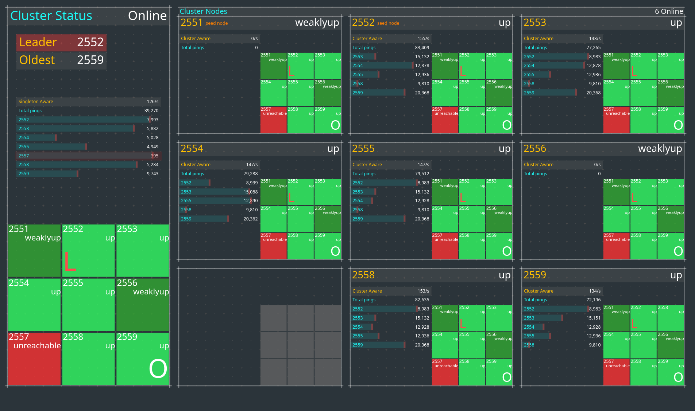

## Akka Typed Java Cluster Singleton Example

This is an Akka Cluster project that includes an example use of
[Cluster Singleton](https://doc.akka.io/docs/akka/current/typed/cluster-singleton.html#cluster-singleton),
the [Receptionist](https://doc.akka.io/docs/akka/current/typed/actor-discovery.html#receptionist),
[Cluster Subscriptions](https://doc.akka.io/docs/akka/current/typed/cluster.html#cluster-subscriptions)
and cluster dashboard.

This project is one in a series of projects that starts with a simple Akka Cluster project and progressively builds up to examples of event sourcing and command query responsibility segregation - CQRS.

The project series is composed of the following GitHub repos:
* [akka-typed-java-cluster](https://github.com/mckeeh3/akka-typed-java-cluster)
* [akka-typed-java-cluster-sbr](https://github.com/mckeeh3/akka-typed-java-cluster-sbr)
* [akka-typed-java-cluster-aware](https://github.com/mckeeh3/akka-typed-java-cluster-aware)
* [akka-typed-java-cluster-singleton](https://github.com/mckeeh3/akka-typed-java-cluster-singleton) (this project)
* [akka-typed-java-cluster-sharding](https://github.com/mckeeh3/akka-typed-java-cluster-sharding) (coming soon)
* [akka-typed-java-cluster-persistence](https://github.com/mckeeh3/akka-typed-java-cluster-persistence) (coming soon)
* [akka-typed-java-cluster-persistence-query](https://github.com/mckeeh3/akka-typed-java-cluster-persistence-query) (coming soon)

Each project can be cloned, built, and runs independently of the other projects.

### About Akka Clustering Singleton Actors

You can read about how Cluster Singletons work in the [Akka documentation](https://doc.akka.io/docs/akka/current/typed/cluster-singleton.html#introduction). Here we will go into how a cluster singleton is used in this demo application.

The cluster singleton actor in this demo receives messages from singleton aware actors at repeating intervals. The singleton actor computes a simple set of message statistics trigged as each message is received. As each node in the cluster starts, the bootstrap process creates one singleton aware actor instance. Each singleton aware actor periodically send ping messages to the singleton actor. The singleton actor responds with a pong message. The pong message contains the singleton's accumulated message statistics.
 
The cluster singleton is implemented in the `ClusterSingletonActor` class.

~~~java
package cluster;

import akka.actor.typed.Behavior;
import akka.actor.typed.javadsl.AbstractBehavior;
import akka.actor.typed.javadsl.ActorContext;
import akka.actor.typed.javadsl.Behaviors;
import akka.actor.typed.javadsl.Receive;
import org.slf4j.Logger;

import java.time.Duration;
import java.time.Instant;
import java.util.Collections;
import java.util.HashMap;
import java.util.Map;
import java.util.stream.IntStream;

import static cluster.ClusterSingletonAwareActor.Message;

class ClusterSingletonActor extends AbstractBehavior<Message> {
  private final SingletonStatistics singletonStatistics = new SingletonStatistics();
  
  static Behavior<Message> create() {
    return Behaviors.setup(ClusterSingletonActor::new);
  }

  ClusterSingletonActor(ActorContext<Message> actorContext) {
    super(actorContext);
  }

  eOverride
  public Receive<Message> createReceive() {
    return newReceiveBuilder()
        .onMessage(ClusterSingletonAwareActor.Ping.class, this::onPing)
        .build();
  }

  private Behavior<Message> onPing(ClusterSingletonAwareActor.Ping ping) {
    singletonStatistics.ping(ping);
    if (singletonStatistics.totalPings % 100 == 0) {
      log().info("<=={}", ping);
    }
    ping.replyTo.tell(new ClusterSingletonAwareActor.Pong(getContext().getSelf(), ping.start, 
        singletonStatistics.totalPings, singletonStatistics.pingRatePs, Collections.unmodifiableMap(singletonStatistics.nodePings)));
    return Behaviors.same();
  }

  static class SingletonStatistics {
    int totalPings = 0;
    int pingRatePs = 0;
    final Instant startTime = Instant.now();
    Map<Integer, Integer> nodePings = new HashMap<>();

    SingletonStatistics() {
      IntStream.rangeClosed(2551, 2559).forEach(p -> nodePings.put(p, 0));
    }

    void ping(ClusterSingletonAwareActor.Ping ping) {
      ++totalPings;
      pingRatePs = (int) (totalPings / Math.max(1 ,Duration.between(startTime, Instant.now()).toSeconds()));

      if (ping.port >= 2551 && ping.port <= 2559) {
        nodePings.put(ping.port, 1 + nodePings.getOrDefault(ping.port, 0));
      }
    }
  }

  private Logger log() {
    return getContext().getLog();
  }
}

~~~

This actor receives `Ping` messages and replies with `Pong` messages.

~~~java
  public Receive<Message> createReceive() {
    return newReceiveBuilder()
        .onMessage(ClusterSingletonAwareActor.Ping.class, this::onPing)
        .build();
  }
~~~
~~~java
  private Behavior<Message> onPing(ClusterSingletonAwareActor.Ping ping) {
    singletonStatistics.ping(ping);
    if (singletonStatistics.totalPings % 100 == 0) {
      log().info("<=={}", ping);
    }
    ping.replyTo.tell(new ClusterSingletonAwareActor.Pong(getContext().getSelf(), ping.start, 
        singletonStatistics.totalPings, singletonStatistics.pingRatePs, Collections.unmodifiableMap(singletonStatistics.nodePings)));
    return Behaviors.same();
  }
~~~

The state of this actor is handled by the internally defined `SingletonStatistics` class. When each `Ping` message is received, this class's `ping` method is invoked.  

~~~java
    void ping(ClusterSingletonAwareActor.Ping ping) {
      ++totalPings;
      pingRatePs = (int) (totalPings / Math.max(1 ,Duration.between(startTime, Instant.now()).toSeconds()));

      if (ping.port >= 2551 && ping.port <= 2559) {
        nodePings.put(ping.port, 1 + nodePings.getOrDefault(ping.port, 0));
      }
    }
~~~

The `ping` method increments some counters, one counter for the total number of ping messages sent to this actor, and another counter that counts the ping messages by port number. The port number identifies the source node of the actor that sent the ping message.

Here is the `ClusterSingletonAwareActor`.

~~~java
package cluster;

import akka.actor.typed.ActorRef;
import akka.actor.typed.Behavior;
import akka.actor.typed.javadsl.*;
import akka.cluster.Cluster;
import akka.cluster.typed.ClusterSingleton;
import akka.cluster.typed.SingletonActor;
import com.fasterxml.jackson.annotation.JsonCreator;
import org.slf4j.Logger;

import java.io.Serializable;
import java.time.Duration;
import java.util.Map;
import java.util.Optional;

class ClusterSingletonAwareActor extends AbstractBehavior<ClusterSingletonAwareActor.Message> {
  private final ActorRef<Message> clusterSingletonProxy;
  private final ActorRef<HttpServer.Statistics> httpServerActor;
  private static final Duration tickInterval = Duration.ofMillis(25 + Math.round(50 * Math.random())); // avg 50ms per tick
  private final int port;

  static Behavior<Message> create(ActorRef<HttpServer.Statistics> httpServerActor) {
    return Behaviors.setup(actorContext ->
        Behaviors.withTimers(timer -> new ClusterSingletonAwareActor(actorContext, timer, httpServerActor)));
  }

  ClusterSingletonAwareActor(ActorContext<Message> actorContext, TimerScheduler<Message> timers, ActorRef<HttpServer.Statistics> httpServerActor) {
    super(actorContext);
    this.httpServerActor = httpServerActor;
    final Optional<Integer> port = Cluster.get(actorContext.getSystem()).selfAddress().getPort();
    this.port = port.orElse(-1);

    clusterSingletonProxy = ClusterSingleton.get(actorContext.getSystem())
        .init(SingletonActor.of(ClusterSingletonActor.create(), ClusterSingletonActor.class.getSimpleName()));
    timers.startTimerAtFixedRate(Tick.Instance, tickInterval);
  }

  @Override
  public Receive<Message> createReceive() {
    return newReceiveBuilder()
        .onMessage(Tick.class, notUsed -> onTick())
        .onMessage(Pong.class, this::onPong)
        .build();
  }

  private Behavior<Message> onTick() {
    clusterSingletonProxy.tell(new Ping(getContext().getSelf(), port, System.nanoTime()));
    return Behaviors.same();
  }

  private Behavior<Message> onPong(Pong pong) {
    if (pong.totalPings % 100 == 0) {
      log().info("<--{}", pong);
    }
    httpServerActor.tell(new HttpServer.SingletonAwareStatistics(pong.totalPings, pong.pingRatePs, pong.singletonStatistics));
    return Behaviors.same();
  }

  interface Message extends Serializable {
  }

  public static class Ping implements Message, Serializable {
    public final ActorRef<Message> replyTo;
    public final int port;
    public final long start;

    @JsonCreator
    public Ping(ActorRef<Message> replyTo, int port, long start) {
      this.replyTo = replyTo;
      this.port = port;
      this.start = start;
    }

    @Override
    public String toString() {
      return String.format("%s[%d, %s]", getClass().getSimpleName(), port, replyTo.path());
    }
  }

  public static class Pong implements Message, Serializable {
    public final ActorRef<Message> replyFrom;
    public final long pingStart;
    public final int totalPings;
    public final int pingRatePs;
    public final Map<Integer, Integer> singletonStatistics;

    @JsonCreator
    public Pong(ActorRef<Message> replyFrom, long pingStart, int totalPings, int pingRatePs, Map<Integer, Integer> singletonStatistics) {
      this.replyFrom = replyFrom;
      this.pingStart = pingStart;
      this.totalPings = totalPings;
      this.pingRatePs = pingRatePs;
      this.singletonStatistics = singletonStatistics;
    }

    @Override
    public String toString() {
      return String.format("%s[%s, %,dns, %s]", getClass().getSimpleName(), replyFrom.path(), System.nanoTime() - pingStart, singletonStatistics);
    }
  }

  enum Tick implements Message {
    Instance
  }

  private Logger log() {
    return getContext().getLog();
  }
}
~~~

A fixed rate timer is used to trigger sending `ping` messages to the cluster singleton actor.

~~~java
    timers.startTimerAtFixedRate(Tick.Instance, tickInterval);
~~~

The timer is initialized in the constructor. On each timer tick, a `tick` message is sent to this actor.

~~~java
  public Receive<Message> createReceive() {
    return newReceiveBuilder()
        .onMessage(Tick.class, notUsed -> onTick())
        .onMessage(Pong.class, this::onPong)
        .build();
  }
~~~

On receiving each `tick` message the `onTick` method is invoked.

~~~java
  private Behavior<Message> onTick() {
    clusterSingletonProxy.tell(new Ping(getContext().getSelf(), port, System.nanoTime()));
    return Behaviors.same();
  }
~~~

A `ping' message is sent to the singleton actor via a singleton proxy. The singleton proxy is initialized in the class constructor.

~~~java
    clusterSingletonProxy = ClusterSingleton.get(actorContext.getSystem())
        .init(SingletonActor.of(ClusterSingletonActor.create(), ClusterSingletonActor.class.getSimpleName()));
~~~

When the singleton actor responds with a `pong' message, the message is handled in the `onPong` method.

~~~java
  private Behavior<Message> onPong(Pong pong) {
    if (pong.totalPings % 100 == 0) {
      log().info("<--{}", pong);
    }
    httpServerActor.tell(new HttpServer.SingletonAwareStatistics(pong.totalPings, pong.pingRatePs, pong.singletonStatistics));
    return Behaviors.same();
  }
~~~

### Installation

~~~bash
$ git clone https://github.com/mckeeh3/akka-typed-java-cluster-singleton.git
$ cd akka-typed-java-cluster-singleton
$ mvn clean package
~~~

The Maven command builds the project and creates a self contained runnable JAR.

### Run a cluster (Mac, Linux, Cygwin)

The project contains a set of scripts that can be used to start and stop individual cluster nodes or start and stop a cluster of nodes.

The main script `./akka` is provided to run a cluster of nodes or start and stop individual nodes.

~~~bash
$ ./akka
~~~
Run the akka script with no parameters to see the available options.
~~~
This CLI is used to start, stop and view the dashboard nodes in an Akka cluster.

These commands manage the Akka cluster as defined in this project. A cluster
of nodes is started using the JAR file built with the project Maven POM file.

Cluster commands are used to start, stop, view status, and view the dashboard Akka cluster nodes.

./akka cluster start N | stop | status | dashboard [N]
./akka cluster start [N]      # Starts one or more cluster nodes as specified by [N] or default 9, which must be 1-9.
./akka cluster stop           # Stops all currently cluster nodes.
./akka cluster status         # Shows an Akka Management view of the cluster status/state.
./akka cluster dashboard [N]  # Opens an Akka cluster dashboard web page hosted on the specified [N] or default 1, which must be 1-9.

Node commands are used to start, stop, kill, down, or tail the log of cluster nodes.
Nodes are started on port 255N and management port 855N, N is the node number 1-9.

./akka node start N | stop N | kill N | down N | tail N
./akka node start N...  # Start one or more cluster nodes for nodes 1-9.
./akka node stop N...   # Stop one or more cluster nodes for nodes 1-9.
./akka node kill N...   # Kill (kill -9) one or more cluster nodes for nodes 1-9.
./akka node down N...   # Down one or more cluster nodes for nodes 1-9.
./akka node tail N      # Tail the log file of the specified cluster node for nodes 1-9.

Net commands are used to block and unblock network access to cluster nodes.

./akka net block N | unblock | view | enable | disable
./akka net block N...  # Block network access to node ports, ports 255N, nodes N 1-9.
./akka net unblock     # Reset the network blocking rules.
./akka net view        # View the current network blocking rules.
./akka net enable      # Enable packet filtering, which enables blocking network access to cluster nodes. (OSX only)
./akka net disable     # Disable packet filtering, which disables blocking network access to cluster nodes. (OSX only)
~~~

The `cluster` and `node` start options will start Akka nodes on ports 2551 through 2559.
Both `stdin` and `stderr` output is sent to a log files in the `/tmp` directory using the file naming convention `/tmp/<project-dir-name>-N.log`.

Start a cluster of nine nodes running on ports 2551 to 2559.
~~~bash
$ ./akka cluster start
Starting 9 cluster nodes
Start node 1 on port 2551, management port 8551, HTTP port 9551
Start node 2 on port 2552, management port 8552, HTTP port 9552
Start node 3 on port 2553, management port 8553, HTTP port 9553
Start node 4 on port 2554, management port 8554, HTTP port 9554
Start node 5 on port 2555, management port 8555, HTTP port 9555
Start node 6 on port 2556, management port 8556, HTTP port 9556
Start node 7 on port 2557, management port 8557, HTTP port 9557
Start node 8 on port 2558, management port 8558, HTTP port 9558
Start node 9 on port 2559, management port 8559, HTTP port 9559
~~~

Stop all currently running cluster nodes.
~~~bash
$ ./akka cluster stop
Stop node 1 on port 2551
Stop node 2 on port 2552
Stop node 3 on port 2553
Stop node 4 on port 2554
Stop node 5 on port 2555
Stop node 6 on port 2556
Stop node 7 on port 2557
Stop node 8 on port 2558
Stop node 9 on port 2559
~~~

Stop node 3 on port 2553.
~~~bash
$ ./akka node stop 3
Stop node 3 on port 2553
~~~

Stop nodes 5 and 7 on ports 2555 and 2557.
~~~bash
$ ./akka node stop 5 7
Stop node 5 on port 2555
Stop node 7 on port 2557
~~~

Start node 3, 5, and 7 on ports 2553, 2555 and2557.
~~~bash
$ ./akka node start 3 5 7
Start node 3 on port 2553, management port 8553, HTTP port 9553
Start node 5 on port 2555, management port 8555, HTTP port 9555
Start node 7 on port 2557, management port 8557, HTTP port 9557
~~~

Start a cluster of four nodes on ports 2551, 2552, 2553, and 2554.
~~~bash
$ ./akka cluster start 4
Starting 4 cluster nodes
Start node 1 on port 2551, management port 8551, HTTP port 9551
Start node 2 on port 2552, management port 8552, HTTP port 9552
Start node 3 on port 2553, management port 8553, HTTP port 9553
Start node 4 on port 2554, management port 8554, HTTP port 9554
~~~

Again, stop all currently running cluster nodes.
~~~bash
$ ./akka cluster stop
~~~

The `./akka cluster status` command displays the status of a currently running cluster in JSON format using the
[Akka Management](https://developer.lightbend.com/docs/akka-management/current/index.html)
extension
[Cluster Http Management](https://developer.lightbend.com/docs/akka-management/current/cluster-http-management.html).

### The Cluster Dashboard ###

Included in this project is a cluster dashboard. The dashboard visualizes live information about a running cluster.  

~~~bash
$ git clone https://github.com/mckeeh3/akka-typed-java-cluster-singleton.git
$ cd akka-typed-java-cluster-singleton
$ mvn clean package
$ ./akka cluster start
$ ./akka cluster dashboard
~~~
Follow the steps above to download, build, run, and bring up a dashboard in your default web browser.

The following sequence of commands changes the cluster state as shown below.

~~~bash
$ ./akka node stop 1 6    
Stop node 1 on port 2551
Stop node 6 on port 2556

$ ./akka node kill 7  
Kill node 7 on port 2557

$ ./akka node start 1 6  
Start node 1 on port 2551, management port 8551, HTTP port 9551
Start node 6 on port 2556, management port 8556, HTTP port 9556
~~~

Note that node 1 and 6 remain in a "weekly up" state. (You can learn more about Akka clusters in the
[Cluster Specification](https://doc.akka.io/docs/akka/current/typed/cluster-concepts.html#cluster-specification)
and the
[Cluster Membership Service](https://doc.akka.io/docs/akka/current/typed/cluster-membership.html#cluster-membership-service)
documentation)

Also note that the
[leader](https://doc.akka.io/docs/akka/current/typed/cluster-membership.html#leader),
indicated by the "L" moves from node 1 to 2. The leader "L" is red, which indicates that one or more nodes are in an unreachable state. While in this state the leader will not promote nodes to an "up" state. This is the reason why in the above example new nodes remain in a weakly up state.

The [oldest node](https://doc.akka.io/docs/akka/current/typed/cluster-singleton.html#singleton-manager),
indicated by the "O" in node 5, moved from node 1 to node 5. The visualization of the cluster state changes is shown in the dashboard as they happen.

### How the Cluster Dashboard Works ###

When the dashboard web page loads, it kicks off included JavaScript code used to render the dashboard web page. The
[p5.js JavaScript library](https://p5js.org/)
does most of the actual rendering of running Akka clusters.

The dashboard layout on the left shows the current state of the cluster from the perspective of the current leader node. Please see the
[Leader documentation](https://doc.akka.io/docs/akka/current/typed/cluster-membership.html#leader)
for more details about its role in the cluster. That said, the leader node is not that significant; it is NOT a cluster master node.

The left panel also shows Leader node port and the Oldest node port. The Leader node is responsible for making cluster state changes. The Oldest node is of interest when using
[cluster singleton actors](https://doc.akka.io/docs/akka/current/typed/cluster-singleton.html#singleton-manager).
Cluster singletons will be covered in more detail in the
[akka-typed-java-cluster-singleton](https://github.com/mckeeh3/akka-typed-java-cluster-singleton)
project in this series.

The right-hand side of the dashboard shows the current state of the cluster from the perspective of each of the currently running cluster nodes. The dashboard asks each node for its current view of the cluster. The JavaScript in the dashboard sends an HTTP request to each of the nine nodes in the cluster. The currently running nodes each return a JSON response that contains that node's state and what it knows about the current state of the cluster.

~~~java
  HttpServerActor(ActorContext<HttpServer.Statistics> context) {
    this.context = context;

    httpServer = HttpServer.start(context.getSystem());
  }
~~~

The server-side that responds to the incoming HTTP requests from the client-side JavaScript is handled in the `HttpServer` class. As shown above, the `HttpServerActor` class creates an instance of the `HttpServer` class.

~~~java
  private Route route() {
    return concat(
        path("", () -> getFromResource("dashboard.html", ContentTypes.TEXT_HTML_UTF8)),
        path("dashboard.html", () -> getFromResource("dashboard.html", ContentTypes.TEXT_HTML_UTF8)),
        path("dashboard.js", () -> getFromResource("dashboard.js", ContentTypes.APPLICATION_JSON)),
        path("dashboard-cluster-aware.js", () -> getFromResource("dashboard-cluster-aware.js", ContentTypes.APPLICATION_JSON)),
        path("dashboard-singleton-aware.js", () -> getFromResource("dashboard-singleton-aware.js", ContentTypes.APPLICATION_JSON)),
        path("p5.js", () -> getFromResource("p5.js", ContentTypes.APPLICATION_JSON)),
        path("favicon.ico", () -> getFromResource("favicon.ico", MediaTypes.IMAGE_X_ICON.toContentType())),
        path("cluster-state", this::clusterState)
    );
  }
~~~

Akka HTTP handles the routing and processing of requests as defined in the `route` method shown above.

~~~java
  private Route clusterState() {
    return get(
        () -> respondWithHeader(RawHeader.create("Access-Control-Allow-Origin", "*"),
            () -> complete(loadNodes(actorSystem, clusterAwareStatistics, singletonAwareStatistics).toJson()))
    );
  }
~~~

The web client sends an HTTP request to the `/cluster-state` endpoint. This invokes the `loadNodes` method.  

The `loadNodes` does all of the work retrieving the cluster information from the perspective of that node. Note that the HTTP response includes an `Access-Control-Allow-Origin *` HTTP header. This header allows cross-domain access from the web client to each of the up to nine running cluster nodes.

~~~java
  private static Nodes loadNodes(ActorSystem<?> actorSystem, ClusterAwareStatistics clusterAwareStatistics, SingletonAwareStatistics singletonAwareStatistics) {
    final Cluster cluster = Cluster.get(actorSystem);
    final ClusterEvent.CurrentClusterState clusterState = cluster.state();

    final Set<Member> unreachable = clusterState.getUnreachable();

    final Optional<Member> old = StreamSupport.stream(clusterState.getMembers().spliterator(), false)
        .filter(member -> member.status().equals(MemberStatus.up()))
        .filter(member -> !(unreachable.contains(member)))
        .reduce((older, member) -> older.isOlderThan(member) ? older : member);

    final Member oldest = old.orElse(cluster.selfMember());

    final List<Integer> seedNodePorts = seedNodePorts(actorSystem);

    final Nodes nodes = new Nodes(
        memberPort(cluster.selfMember()),
        cluster.selfMember().address().equals(clusterState.getLeader()),
        oldest.equals(cluster.selfMember()),
        clusterAwareStatistics, singletonAwareStatistics);

    StreamSupport.stream(clusterState.getMembers().spliterator(), false)
        .forEach(new Consumer<Member>() {
          @Override
          public void accept(Member member) {
            nodes.add(member, leader(member), oldest(member), seedNode(member));
          }

          private boolean leader(Member member) {
            return member.address().equals(clusterState.getLeader());
          }

          private boolean oldest(Member member) {
            return oldest.equals(member);
          }

          private boolean seedNode(Member member) {
            return seedNodePorts.contains(memberPort(member));
          }
        });

    clusterState.getUnreachable()
        .forEach(nodes::addUnreachable);

    return nodes;
  }
~~~

The `loadNodes` method uses the `ClusterEvent.CurrentClusterState` Akka class to retrieve information about each of the currently running cluster nodes. The cluster state information is loaded into an instance of the `Nodes` class. The `Nodes` class contains a list of `Node` class instances, which contain information about each of the currently running cluster nodes.

It is essential to understand that the cluster state retrieved from each node represents how each specific node currently sees the other nodes in the cluster.

While it is relatively easy to retrieve cluster state information, the actual process of communicating cluster state changes across the cluster is complex. Fortunately, maintaining the cluster state is managed within the Akka actor systems running on each node.

Once all of the cluster state information has been loaded into the `Nodes` class instance, along with its list of nodes, the entire object is serialized to JSON and returned to the web client in an HTTP response.

The web client assembles the JSON responses from each of the currently running cluster nodes and renders that information into the nine node panels on the right side of the dashboard. The current leader node information is also rendered on the left side of the dashboard.

By design, it is possible to observe the propagation of cluster state changes across the nodes in the dashboard. By polling each node in the cluster, it is possible to see some of the latency as cluster state changes propagate across the network to each node in the cluster.

The dashboard shows cluster state changes as they happen. Use this feature to explore how the cluster reacts as nodes join and leave the cluster. Try starting a cluster and then stopping, killing, or downing nodes and observe how this impacts the overall cluster state.
